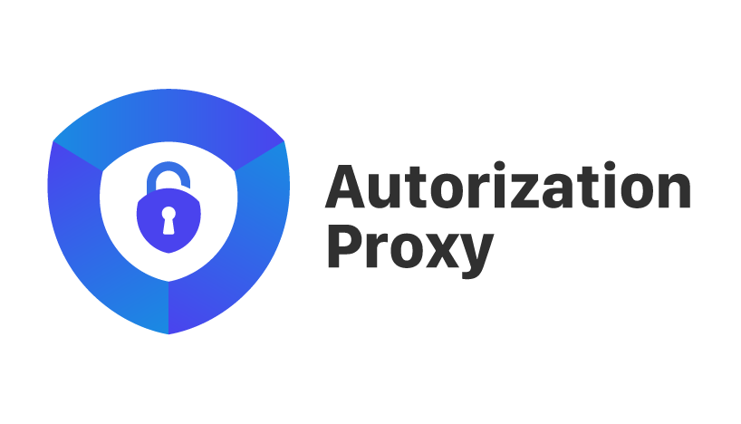

# Authorization Proxy

<!-- TOC -->

- [What is Authorization Proxy](#what-is-authorization-proxy)
- [Use case](#use-case)
  - [Authorization and Authorization request](#authorization-and-authorization-request)
    - [Athenz authorizer](#athenz-authorizer)
    - [Authorization success](#authorization-success)
    - [Authorization failed](#authorization-failed)
  - [Mapping rules](#mapping-rules)
  - [HTTP request headers](#http-request-headers)
- [Features to Debug](#features-to-debug)
- [Configuration](#configuration)
- [Contributor License Agreement](#contributor-license-agreement)
- [About releases](#about-releases)

<!-- /TOC -->
<!--markdownlint-disable MD013-->

## What is Authorization Proxy

Authorization Proxy is an implementation of [Kubernetes sidecar container](https://kubernetes.io/blog/2015/06/the-distributed-system-toolkit-patterns/) to provide a common interface for API endpoint authentication and authorization. It caches the policies from [Athenz](https://github.com/yahoo/athenz), and provides a reverse proxy interface to control access on specific URL endpoints.

Client request can be authenticated and authorized by:
1. OAuth2 access token
1. Role token in the HTTP/HTTPS request header
1. Role certificate on mTLS

Requires go 1.19 or later.

## Use case

### Authorization and Authorization request

Authorization Proxy acts as a reverse proxy sitting in front of the server application. When the client request for specific URL endpoint of the server application, the request comes to authorization proxy first.

#### Athenz authorizer

To authenticate the request, the authorization proxy should know which client identity (role) can take an action on which URL endpoint, therefore the Athenz authorizer is introduced.

The [Athenz authorizer](https://github.com/AthenZ/athenz-authorizer) periodically updates the access token JWK, role token public key, and Athenz policy data from the Athenz Server. It decodes and validates the policy data. The decoded policy will store in the memory cache inside the Athenz authorizer for later authorization checks. The Athenz authorizer also helps to extract client credentials from the HTTP/HTTPS request header.

#### Authorization success

The authorization proxy will call the Athenz authorizer and check if the client can take an action to a specific URL endpoint. If the client is allowed to take an action the URL endpoint, the request will then be forwarded to the server application with authorization information.([HTTP request headers](#http-request-headers))

#### Authorization failed

The authorization proxy will return `401 Unauthorized` to the client whenever the client credentials are missing/invalid, or the client identity (role) presented in the client credentials has no privilege to take the specific action on the specific URL endpoints.

---

### Mapping rules

The mapping rules describe the elements used in the authorization proxy. You can configure which Athenz domains are effective in the Authorization Proxy, and design your own sets of Athenz policies to control client access on the server application's endpoints.

The mapping rules are described as below.

| Concept         | Description                                                | Map to (Athenz)  | Example            |
|-----------------|------------------------------------------------------------|------------------|--------------------|
| Client Identity | Client Identity presented in the client credentials        | Role             | access token scope |
| Action          | HTTP/HTTPS request method                                  | Action           | POST               |
| Resource        | HTTP/HTTPS request URL path, supports wildcard             | Resource         | /api/*             |

⚠️ All the HTTP/HTTPS methods and URI paths are normalized to lower case.

### HTTP request headers

When a request is authorized by the authorization proxy, the following HTTP headers is added in the request.

| HTTP Header Name    | Description                                                              | Example           |
|---------------------|--------------------------------------------------------------------------|-------------------|
| X-Athenz-Principal  | Authorized principal                                                     | principal         |
| X-Athenz-Role       | Authorized role (A comma-separated string if there is more than one)      | role1,role2,role3 |
| X-Athenz-Domain     | Authorized domain                                                        | domain            |
| X-Athenz-Client-ID  | Authorized client ID                                                     | client-id         |
| X-Athenz-Issued-At  | Unix timestamp in second that the authorized identity was issued                          | 1596158946        |
| X-Athenz-Expires-At | Unix timestamp in second that the authorized identity expires                             | 1596158953        |

## Features to Debug

- [Configuration](./docs/debug.md)

## Configuration

The example configuration file is [here](./test/data/example_config.yaml).
For detail explanation, please read [config.go](./config/config.go).

---

## Contributor License Agreement

This project requires contributors to agree to a [Contributor License Agreement (CLA)](https://gist.github.com/ydnjp/3095832f100d5c3d2592).

Note that only for contributions to the `authorization-proxy` repository on the [GitHub](https://github.com/AthenZ/authorization-proxy), the contributors of them shall be deemed to have agreed to the CLA without individual written agreements.

## About releases

- Releases
  - 
  - 
