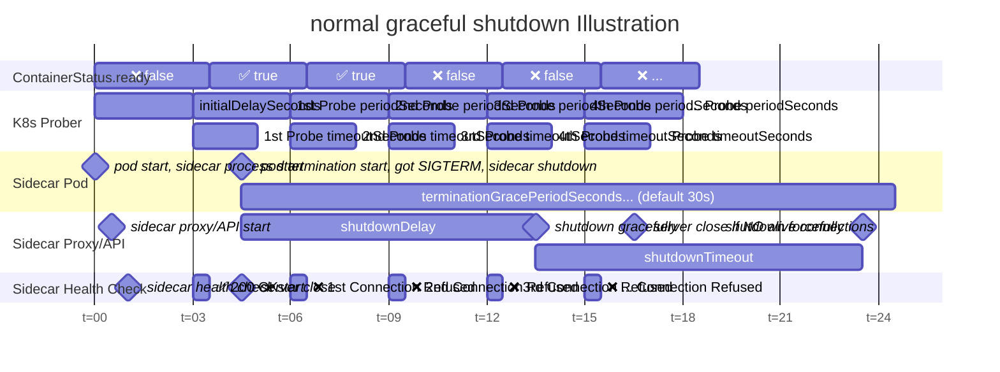

# Graceful shutdown

The sidecar server supports graceful shutdown.
To enable it, set `shutdownTimeout` and `shutdownDelay` to value > 0 in the `config.yaml`.

<!-- TOC -->

- [Graceful shutdown](#graceful-shutdown)
  - [Rolling update in K8s with graceful shutdown](#rolling-update-in-k8s-with-graceful-shutdown)
  - [Illustration of a normal graceful shutdown](#illustration-of-a-normal-graceful-shutdown)

<!-- /TOC -->

## Rolling update in K8s with graceful shutdown

1. make sure the `strategy` is set in the deployment
    - sample
    ```yaml
    apiVersion: apps/v1
    kind: Deployment
    spec:
    strategy:
        rollingUpdate:
            maxSurge: 25%
            maxUnavailable: 25%
        type: RollingUpdate
    ```
1. make sure the `readinessProbe` for sidecar is set
    - sample
    ```yaml
    apiVersion: apps/v1
    kind: Deployment
    spec:
        containers:
        -   name: sidecar
            readinessProbe:
                httpGet:
                    path: /healthz
                    port: 8081
                initialDelaySeconds: 3
                timeoutSeconds: 2
                successThreshold: 1
                failureThreshold: 2
                periodSeconds: 3
    ```
1. make sure the `config.yaml` has the correct value
    - `shutdownDelay = failureThreshold * periodSeconds + timeoutSeconds` (add 1s for buffer)
    - `0 < shutdownTimeout < terminationGracePeriodSeconds - shutdownDelay`
    - sample
    ```yaml
    version: "v2.0.0"
    server:
        shutdownTimeout: 10s
        shutdownDelay: 9s
        healthCheck:
            port: 8081
            endpoint: "/healthz"
    ```
1. make sure your application can still handle new requests after shutdown for `shutdownDelay` seconds

## Illustration of a normal graceful shutdown


