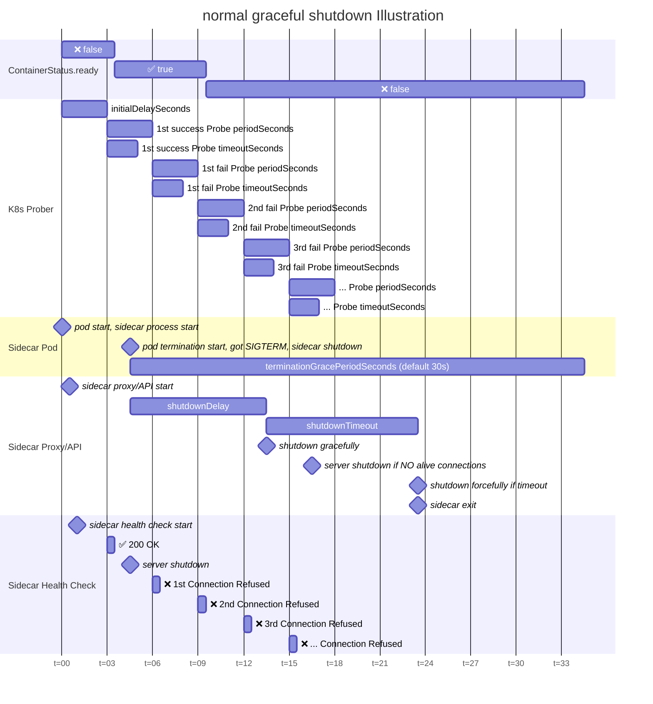

# Graceful shutdown

The sidecar proxy/API server supports graceful shutdown.
To enable it, set `shutdownTimeout` and `shutdownDelay` to value > 0 in the `config.yaml`.

<!-- TOC -->

- [Graceful shutdown](#graceful-shutdown)
  - [Rolling update in K8s with graceful shutdown](#rolling-update-in-k8s-with-graceful-shutdown)
  - [Illustration of a normal graceful shutdown](#illustration-of-a-normal-graceful-shutdown)
    - [Factors to determine `shutdownDelay` and `shutdownTimeout`](#factors-to-determine-shutdowndelay-and-shutdowntimeout)

<!-- /TOC -->

## Rolling update in K8s with graceful shutdown

> [!NOTE]  
> The following set of sample values should be sufficient for most cases. Please fine-tune the values only if you encounter unexpected issues and fully understand the relationship between them.

1. make sure the `strategy` is set in the deployment
    - sample
    ```yaml
    apiVersion: apps/v1
    kind: Deployment
    spec:
    strategy:
        rollingUpdate:
            maxSurge: 25%
            maxUnavailable: 25%
        type: RollingUpdate
    ```
1. make sure the `readinessProbe` for sidecar is set
    - make sure `periodSeconds` > `timeoutSeconds`, else the behavior is undefined
    - sample
    ```yaml
    apiVersion: apps/v1
    kind: Deployment
    spec:
        containers:
        -   name: sidecar
            readinessProbe:
                httpGet:
                    path: /healthz
                    port: 8081
                initialDelaySeconds: 3
                periodSeconds: 3
                timeoutSeconds: 2
                successThreshold: 1
                failureThreshold: 2
    ```
1. make sure the `config.yaml` has the correct value
    - `shutdownDelay = (failureThreshold * periodSeconds) + timeoutSeconds + 1s`
    - `0 < shutdownTimeout < terminationGracePeriodSeconds - shutdownDelay`
    - sample
    ```yaml
    version: "v2.0.0"
    server:
        shutdownTimeout: 10s
        shutdownDelay: 9s
        healthCheck:
            port: 8081
            endpoint: "/healthz"
    ```
1. make sure your application can still handle new requests after shutdown for `shutdownDelay` seconds

## Illustration of a normal graceful shutdown



### Factors to determine `shutdownDelay` and `shutdownTimeout`

- To ensure that there is NO new incoming requests during shutdown, sidecar proxy/API should ONLY shutdown when `Container.Status.ready == false`
  - implies `shutdownDelay` >= `(1st failing probe timestamp - SIGTERM timestamp)` + `((failureThreshold - 1) * periodSeconds)` + `timeoutSeconds`
    - implies `shutdownDelay = periodSeconds + ((failureThreshold - 1) * periodSeconds) + timeoutSeconds`
    - implies `shutdownDelay = (failureThreshold * periodSeconds) + timeoutSeconds`
  - there is delay for `Container.Status.ready` to update and stop receiving new requests
    - add 1s to shutdownDelay for buffer
    - implies `shutdownDelay = (failureThreshold * periodSeconds) + timeoutSeconds + 1s`
- To ensure that the shutdown process can complete before `SIGKILL`, the total shutdown time should be shorter than `terminationGracePeriodSeconds`
  - implies `shutdownDelay` + `shutdownTimeout` < `terminationGracePeriodSeconds`
    - implies `shutdownTimeout < terminationGracePeriodSeconds - shutdownDelay`
  - gracefully shutdown requires `shutdownTimeout > 0`
    - implies `0 < shutdownTimeout < terminationGracePeriodSeconds - shutdownDelay`
- When shutdown happens before `initialDelaySeconds`, `Container.Status.ready` will never be `true`. Hence, it does not affect `shutdownDelay` and `shutdownTimeout`.
